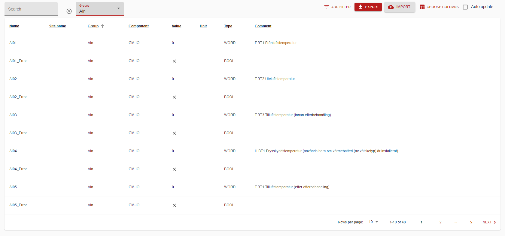

# PTA PMB PLC with web interface

Version 0.1 / 2021-01-22 / AW

[toc]

## Web application

### Login

The login dialog shows the system name (GM1 above), host name (CX-492F8F) and PLC type (CX8190) for the PLC. The user email and password are defined in an array in the PLC GlobalSettings unit. Defaults:

| User type | User name/email | Password | Access                                                       |
| --------- | --------------- | -------- | ------------------------------------------------------------ |
| Standard  | user            | user     | Read and change basic parameters, alarms and event log       |
| Admin     | admin           | admin    | Edit site parameters, edit user list, edit site names for parameters (+user) |
| Super     | super           | super    | Activate PLC components, edit factory settings, view debug log (+admin) |

### Menus

#### Dashboard

Displays an overview of the unit operation.

##### Status icons

##### Auto refresh

#### On/off

Enable and disable the PMB unit. Start stop the TwinCAT PLC. 

NOTE: Stopping the PLC stops everything including fire alarm handling.

#### Set points

#### Alarms

Show alarms when activated and also when reset again. 

#### Parameters

Shows parameters in the PLC depending on user level. The parameters are loaded from the PLC according to what components have been enabled and uses the TwinCAT symbol file (*.pty) to locate the parameter in memory. In this way the web application must not be updated when parameters are added to the PLC program.

##### Pages / groups

Filter on a group or sub-group:

##### Filters

There are also filters for component (BASE, XXL etc) and for parameter type (BOOL, WORD, REAL, TIME, STRING).

##### Write parameter

Click on a row to edit the value and optional site name. Site names are stored in the PLC and can be uploaded and download to file.

Edit the site specific name:

#### IO

Show physical inputs and outputs. Output should not be written unless the PLC is stopped.

#### Site names (admin users)

Lists the site names that has been added.

Delete  a site name:

#### Events

List events such as start stop unit.

#### Users (admin)

Edit users.

##### Permissions

| User type | User name/email | Password | Access                                                       |
| --------- | --------------- | -------- | ------------------------------------------------------------ |
| Standard  | user            | user     | Read and change basic parameters, alarms and event log       |
| Admin     | admin           | admin    | Edit site parameters, edit user list, edit site names for parameters (+user) |
| Super     | super           | super    | Activate PLC components, edit factory default settings, view debug log (+admin) |

#### Debug log (super users)

Error events for development are listed here.

#### Components (super users)

PLC components can be activated here. The PLC then starts executing the PLC component (a function block) and the parameters becomes available in the parameter list.

#### Language

Select language, English or Swedish. Stored in the browser local storage.

## Web application development

### Parameter access

Component ID:s can be used in the web app to reference component parameters in the TwinCAT PLC. These are stored in the PLC and fetched by the web app when loading the page.

The reference is formatted as $(<name>), for example $(GM-BASE) .

In this way the web app can find variables at locations that may differ between PLC versions.

#### $(GM-IO)

Inputs and outputs displayed in the web app IO list.

#### $(GM-BASE)

The web app displays these in the Parameter list view as defined in the PLC by an array of records:

| Property    | Type        | Comment                                                      |
| ----------- | ----------- | ------------------------------------------------------------ |
| Name        | STRING      | The name for this variable section. Displayed as "Component" in the parameter list in the web app, used to reference variables in this section, such as $(GM-BASE) when Name is "GM-BASE" |
| Path        | STRING      | The path in the TwinCAT PLC, such as "Main.GreenMaster.Parameters" |
| EN          | BOOL        | Activates the component                                      |
| Resource    | WSTRING     | Indicates how the parameters should be displayed in the web interface, use "Parameters" for the parameters to be included in main parameter list. Using any other name they will be displayed in a separate menu. |
| Parameters  | WSTRING[]   | Optional strings with key/value for the component.           |
| Permissions | Permissions | Access level for the parameters in the web interface.        |

The parameter display can merge variables from multiple locations.

The PLC definitions are: GlobalSettings.Components

### Parameter setup

Each parameter in the PLC can be configured using the comment following on the same line or on the preceding line:

​	`Par: LINT; // possibly some text $(write 2, setup, step 10) possibly some more text`

The codes can be added anywhere in the line and must be comma-separated, within parenthesis and preceded by a dollar sign.

The codes have the following meaning:

| Code                | n          | Description                                                  | Default             |
| ------------------- | ---------- | ------------------------------------------------------------ | ------------------- |
| write n             | Permission | Write allowed for this parameter. The number n is optional and if present defines the lowest permission level allowed to write the parameter. | 2                   |
| setup               |            | Setup parameter. Used when saving/restoring setup to file    | Not setup parameter |
| user                |            | User parameter. Used when saving/restoring only user settings such as site names. Default not a user parameter. | Not user parameter  |
| read n              | Permission | Lowest permission level allowed to read this parameter       | 2                   |
| decimals n          | Decimals   | Decimal format (number of decimals)                          | 1                   |
| time "n"            | format     | Formats time durations such as: "hh:mm:s​s.SSS" or "m", double quotes must be used | "s"                 |
| min n               | number     | Min numeric value, ex N3.14                                  | No limit            |
| max n               | number     | Max numeric value, ex X3.15                                  | No limit            |
| step n              | number     | Step for numeric values, arrow up/down or buttons            | 1                   |
| unit "n"            | unit       | Unit for numeric parameters such as `C`, `s`, `l/s` or `minutes`, double quotes must be used | ""                  |
| scale "x0 y0 x1 y1" | range      | Scale numerical value from (x0, y0) to (x1, y1)              | No scaling          |

#### Permissions

| Level | Description      |
| ----- | ---------------- |
| 0     | User level       |
| 1     | Admin user level |
| 2     | Super user level |
| 3     | NoOne            |

#### Language

The parameter comment may contain multiple language texts separated by |||| such as:

This is a comment |||| Detta är en kommentar

The first part is always English and the (optional) second part Swedish.

## PLC

### Global settings

These settings are found in the GlobalSettings GVL file (Global Variable List).

#### Web ADS access

The string variable `WebAdsAccessRoot` defines where in the PLC program the variables (parameters) are located. Read by the web application on connect.

#### Plc type

The type of Beckhoff IPC is available in the string variable `PlcType`. Read by the web application on connect and displayed on the login screen. Currently only "CX8190" is supported.

#### Users

Login information is stored in the `Users` array. Email and password is used for login. The email can also be a username. No emails are sent but it is recommended to use email to easily keep the logins unique for each person when this is desired. There are also fields for a name and phone number but this is only for information between users.

##### Password

Any password string, including empty, is accepted.

##### Permissions

Three levels are supported:

- User
- AdminUser
- SuperUser

The permissions are intended only to avoid making changes by mistake. Anyone with access to the PLC can easily bypass this "security". The web browser connection to the PLC implements these levels mainly to avoid showing too much information.

##### Security

The connection between the web browser and the PLC can be secured using HTTPS.  This will however only protect against "spying" on the network connection. The web interface in the PLC is not secure unless a client certificate is installed in both PLC and client machines.

#### Site names

Site specific names can be assigned to parameters and displayed in the web interface. These names are stored in the array `SiteNames`. The site names can be downloaded to file and also uploaded from file using the Site name list in the web interface.

#### PLC components

Components are used to divide the PLC application in several parts that can be activated depending on the site. The PTA PMB software is divided in one component for each unit (product) plus some basic components

- GM-BASE - Basic functionality such as alarms and temperature control
- GM-IO - Input and outputs on the PLC
- GM-VENT - Basic ventilation common to several products
- GM-XXL - Functionality for XLL units
- GM-A - Functionality for GMA units
- GM-OPT-XXX - Customer specific optional functions such as Chalmers (GM-OPT-CTH)

Components can be activated in the web interface or directly in the PLC. When activated the functions will execute in the PLC and the corresponding parameters will be included in the parameter list in the web interface or a separate menu, see `Parameter access`.

### 